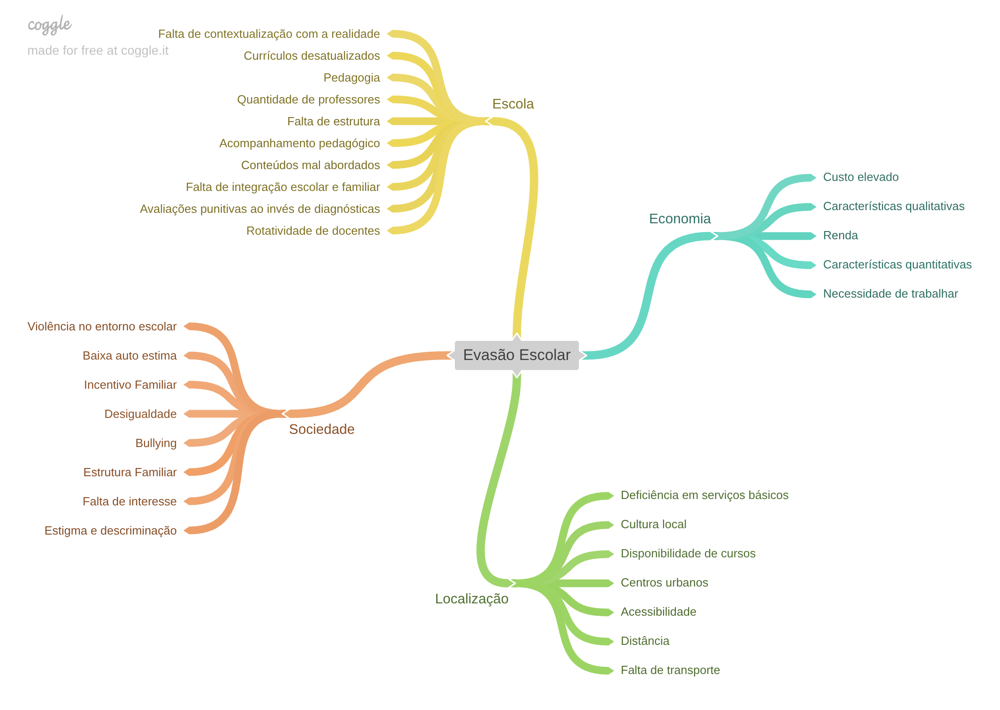
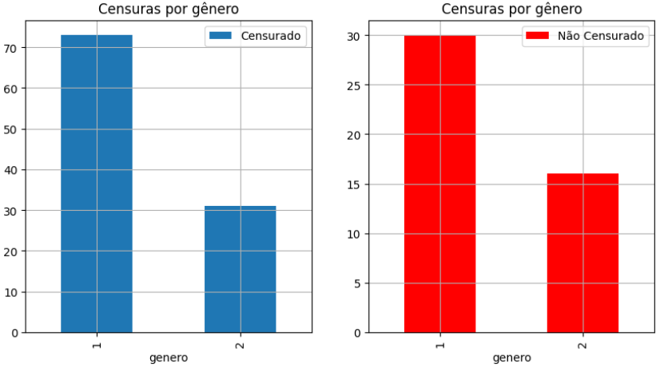
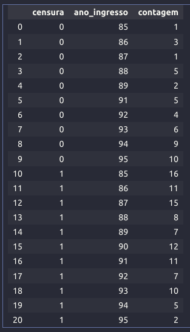
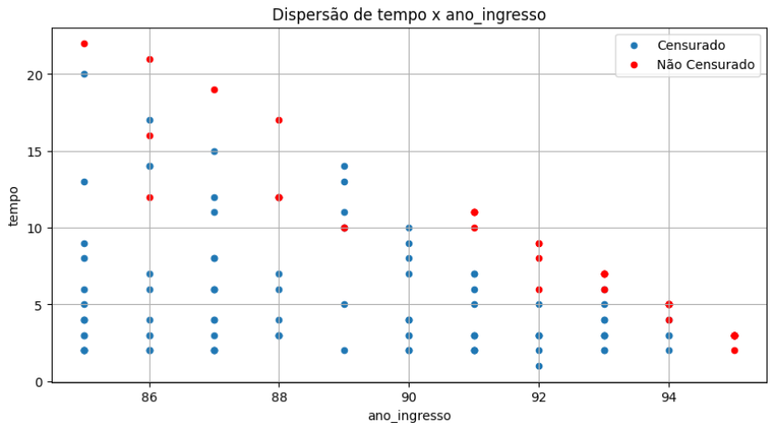
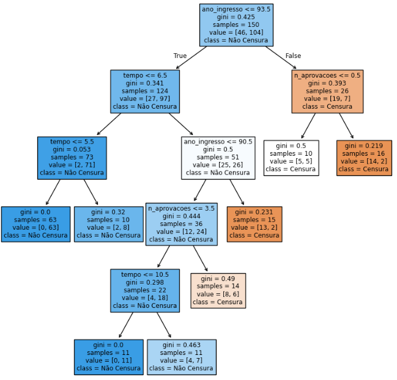
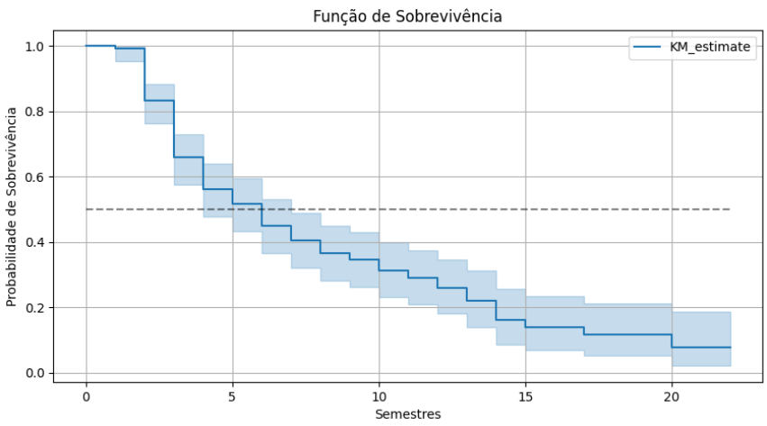
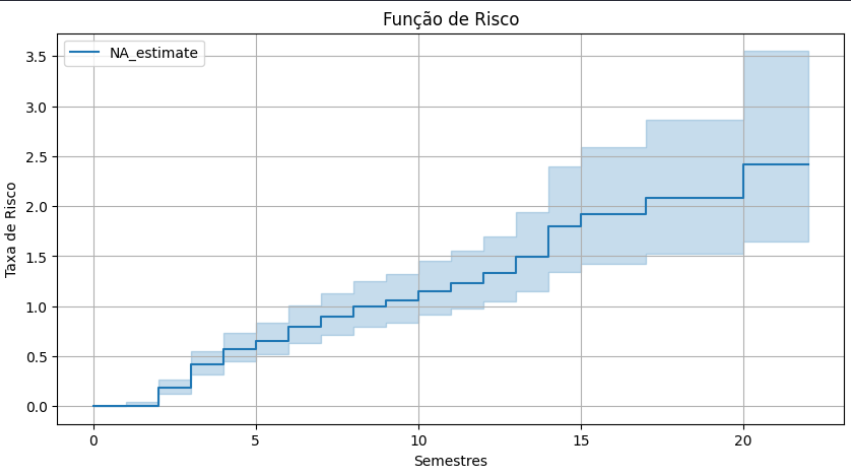

# Análise de Sobrevivência Aplicada a Evasão Escolar

---

---

### Sumário

- [1.0. Problema de Negócios](#10-problema-de-negocios)
- [2.0. Estratégia de Solução](#20-estrategia-de-solucao)
  - [2.1. Introdução](#21-introducao)
  - [2.2. Tamanho da Amostra](#22-tamanho-da-amostra)
- [3.0. Análise Exploratória](#30-analise-exploratoria)
  - [3.1. Mapa Mental](#31-mapa-mental)
  - [3.2. Análise Descritiva](#22-analise-descritiva)
  - [3.3. Análise Bivariada](#33-analise-bivariada)
- [4.0. Validação das Hipóteses](#10-validacao-das-hipoteses)
- [5.0. Próximos Passos](#20-proximos-passos)

---

## 1.0. Problema de Negócios

---

O seguinte projeto tem como objetivo aplicar técnicas de análise exploratória de dados, teste de hipóteses e análise de sobrevivência aplicado ao contexto de evasão escolar.
O seguinte estudo teve motivação devido a um TCC sobre análise de sobrevivência aplicada no estudo da evasão escolar.
Link do TCC: https://lume.ufrgs.br/bitstream/handle/10183/198131/000188649.pdf?sequence=1

A constituição federal de 1988, descreve especialmente nos artigos 205 e 208, que todos os cidadãos têm direito à educação e é dever do estado e da sociedade motivar o desenvolvimento pleno da pessoa no Brasil. Entretanto, hodiernamente, devido às consequências da evasão escolar no curso de graduação em estatística da universidade federal do rio grande do sul, os artigos descritos na constituição não refletem a realidade enfrentada por esses estudantes no país. Diante disso, é necessário um processo de pesquisa, análise exploratória e metodologias científicas para estudar como esse efeito é desenvolvido na sociedade brasileira.

"A evasão é um problema que merece ser estudado com profundidade, tanto pelo aspecto pedagógico envolvido, como econômico e social. Alguns cursos superiores da UFRGS são caracterizados como cursos onde a evasão é grande e preocupante. Diversas causas, identificadas através de pesquisas realizadas pela Universidade, são apontadas: necessidade de trabalhar, incompatibilidade de horário de trabalho e estudo, curso que não correspondeu às expectativas, etc." (Tcc, p. 42).

## 2.0. Estratégia de Solução

---

### 2.1. Introdução

O projeto consiste em principalmente três notebooks, dentro da do diretório `src`, contendo algumas etapas do processo de pesquisa.

- O primeiro notebook, `grc_00_sample_size` tem como objetivo estimar o tamanho da amostra necessário de ambos os grupos para a validação das hipóteses. 
- O segundo notebook, `grc_01_analise_exploratoria` consiste em análise descritiva e exploratória dos dados, já adianto que é possível fazer análises mais avançadas no conjunto de dados.
- O terceiro e último notebook, `grc_02_validacao_hipoteses` é onde são aplicados o teste para a validação das hipóteses e também a análise de sobrevivência.

Destaco que o segundo e o terceiro notebook podem ser muito bem mais aprofundados, é possível fazer análises exploratórias mais avançadas incluindo hipóteses de negócio, coleta de mais dados para validação de demais hipóteses oriundas dos mapas mentais e também o terceiro notebook pretendo aplicar análise de sobrevivência pontual com o XGBSE, atualmente, a análise foi desenvolvido com a solução tradicional Kaplan-Mayer utilizando todas as amostras disponíveis sem levar em conta variáveis exógenas.

Além da análise exploratória de dados, foi levantado uma hipótese estatística que vai ser validada por meio de inferência frequentista, a hipótese a ser validada é, *existe diferença nas médias das idades dos gêneros dos alunos que evadiram o curso Bacharel em Estatística da UFRGS* ?

Levando em conta essa pergunta, por meio da estatística inferencial clássica, existem duas possibilidades, ou duas alternativas, sendo denominadas "Ho" (Hipótese Nula) e "Ha" (Hipótese Alternativa), considere essas descritas logo abaixo:

- $H_o$: As médias das idades dos dois grupos de alunos são iguais.
- $H_a$: As médias das idades dos dois grupos de alunos são diferentes.

Para validar essas duas hipóteses, antes disso é estimado o tamanho das amostras para ambos os grupos de alunos Analisando a tabela para esses valores são necessárias 393 amostras em cada um dos grupos, ou seja, 393 alunos masculinos e femininos do curso de Bacharel em Estatística que saíram do curso, seja por motivo de transferência, abandono, entre outras.

### 2.2. Tamanho da Amostra

--- 

Para iniciar a estimação do tamanho da amostra é necessário definir algumas variáveis para estimar o tamanho da amostra, são eles o nível de significância, poder estimado e o tamanho do efeito, utilizando esses três valores é possível estimar o tamanho de uma amostra necessária utilizando as tabelas de "*sample size*".

A principal referência para essa estimação é o livro de Jacob Cohen: https://utstat.utoronto.ca/~brunner/oldclass/378f16/readings/CohenPower.pdf

"The tables in this section use values for the significance criterion, the ES to be detected, and the desired power to determine the sample size. They would therefore be of primary utility in the planning of experiments to provide a basis for the decision as to how many sampling units (n) are to be used. Although decisions about sample size in behavioral science are frequently made by appeal to tradition or precedent, ready availability of data, or intuition (Cohen, 1965, p. 97ff), unless Type II error rate considerations contribute to the decision, they can hardly be rational.", (Cohen, 1988, p. 69).

- "*Significance Criterion (a)*": O nível de significância, alpha.
- "*Effect Size (ES)*": O tamanho do efeito a que se deseja observar, ou seja, quanto maior o efeito da hipótese, menor é a quantidade de amostras necessárias, pois o efeito observado no teste é bem nítido, caso o efeito seja baixo, são necessárias mais amostras para de fato observar essa diferença. Em outras palavras, é uma medida padronizada que quantifica a magnitude da diferença entre dois grupos ou a força da relação entre variáveis. Para calcular a quantidade de amostras é necessário estimar um tamanho do efeito.
- "*Desired Power (DP)*": O poder de um teste estatístico é a probabilidade do teste produzir um resultado que é estatisticamente significativo, para esse caso, geralmente o estatístico escolhe um poder entre 0.8 a 0.9. O poder de um teste é a probabilidade de rejeitar corretamente a hipótese nula quando ela é falsa, além disso, é possível calcular o poder do teste pela escolha do nível de significância para o teste, pelo tamanho do efeito que está sendo medido e pela quantidade de dados disponíveis. Para nosso caso de uso, vamos utilizar o poder definido para calcular a quantidade de amostras.

Para fins de iniciativa irei escolher esses valores:

- $a$: 0.05.
- $ES$: 0.2.
- $DP$: 0.8.

Analisando a tabela para esses valores são necessárias 393 amostras em cada um dos grupos, ou seja, 393 alunos masculinos e femininos do curso de Bacharel em Estatística que saíram do curso, seja por motivo de transferência, abandono, entre outras.

A amostra analisada é constituída por 150 alunos do Curso de Bacharelado em Estatística ingressos no período de 1985 a 1995. Dos 150 alunos pesquisados, 70,1% são do sexo masculino e 29,8% são do sexo feminino.

## 3.0. Análise Exploratória

---

### 3.1. Mapa Mental

---

Foi desenvolvido um mapa mental antes da coleta e exploração dos dados para incentivar a extração de mais dados.

O mapa mental é uma ferramenta bacana para ajudar o pesquisador na sua elaboração das perguntas do questionário de coleta de amostras. Dentre os itens citados no mapa mental, foi coletados algumas informações e também demais informações referentes as características dos alunos e também do curso.

Fazendo uma analogia, seria interessante incluir outras características, tanto dos alunos, quanto de seu desempenho no curso para conseguir ter uma mais explicabilidade desse fenômeno.

Além do mais, seria interessante um processo de engenharia de dados caso esse projeto venha a crescer no futuro.

*Feature Stores* possíveis de serem desenvolvidas inicialmente ao longo da evolução do projeto:
- Alunos;
- Desempenho escolar;

### 3.2. Análise Descritiva

---

Aqui abaixo vai uma amostra das top 5 primeiras linhas dessa tabela, todos os dados estão transformados para representações numéricas.

| index | ingresso | genero | idade | n_aprovacoes | n_reprovacoes | tempo | censura | ano_ingresso |
| :---: | :------: | :----: | :---: | :----------: | :-----------: | :---: | :-----: | :----------: |
|   0   |     1    |    1   |   26  |       0      |       1       |   5   |    1    |      85      |
|   1   |     6    |    2   |   21  |       7      |       0       |   6   |    0    |      92      |
|   2   |     1    |    1   |   32  |       4      |       0       |   12  |    1    |      87      |
|   3   |     1    |    1   |   18  |       4      |       0       |   3   |    1    |      92      |
|   4   |     1    |    1   |   24  |       2      |       0       |   17  |    1    |      86      |

Além disso, logo abaixo está uma explicação dessas colunas que foram coletadas no processo de pesquisa desses alunos.

| Coluna            | Descrição                                                                                                                              |
| :---------------- | :------------------------------------------------------------------------------------------------------------------------------------- |
| **index**         | Identificador da linha na amostra (índice sequencial do estudante).                                                                    |
| **ingresso**      | Código numérico representando a forma de ingresso do estudante na universidade (por exemplo: 1 = vestibular, 6 = transferência, etc.). |
| **genero**        | Código do gênero do estudante (geralmente 1 = masculino, 2 = feminino).                                                                |
| **idade**         | Idade do estudante no momento do ingresso no curso.                                                                                    |
| **n_aprovacoes**  | Número de disciplinas em que o estudante foi aprovado no primeiro semestre.                                                                                 |
| **n_reprovacoes** | Número de disciplinas em que o estudante foi reprovado no primeiro semestre.                                                                                |
| **tempo**         | Tempo (em semestres, conforme o estudo) até o evento de interesse ou até a censura.                                            |
| **censura**       | Indicador de censura: 0 = estudante formou-se (ou teve o evento observado), 1 = estudante ainda ativo ou não concluiu (censurado).     |
| **ano_ingresso**  | Ano de ingresso no curso, representado pelos dois últimos dígitos (ex: 85 = 1985, 92 = 1992).                                          |

Durante a análise estatística de primeira ordem, notei alguns pontos interessantes:

- A forte assimetria positiva (skew = 3.46) e alta curtose (13.92) indicam que quase todos os alunos ingressaram pela forma “1” (provavelmente vestibular), com poucos casos em outras categorias (como transferência ou reingresso).
- A média da censura é aproximadamente 70%, isso caracteriza um desbalanceamento de classes, em outras palavras, quase 70% dos alunos ainda não concluiram o curso.
- Existem ingressantes no curso de estatística menores de 18 anos.
- Mais de 50% dos alunos intrevistados entraram por meio do vestibular tradicional (ingresso = 1).
- Intervalo de estudantes em 10 anos de ingresso no curso.
- Assimetria de 0.77 mostra leve concentração em valores baixos, mas há casos com até 6 reprovações.
- Assimetria positiva (1.42) mostra que a maioria tem tempo de curso curto, mas há alunos com longa permanência (até 22 semestres/anos). Isso é típico de cursos com evasão tardia ou alunos que demoram para concluir, possivelmente conciliando estudos e trabalho.

Além disso, destaco abaixo algumas características observadas na análise exploratória.

### 3.3. Análise Bivariada

---

Censuras por gênero.

Não existe nenhuma diferença relativamente grande entre gênero e a evasão do curso, é possível ver esse detalhe tanto nos histogramas quanto nos alunos que abandonaram e não abandonaram o curso. A proporção se mantem a masma para ambos os generos.

Censura por ano de ingresso.

É possível notar que, no ano de 1995 dado ao fato que os alunos estão iniciando o curso, não existe uma grande quantidade de evasão, mas, acredito que ao longo de mais dois anos de curso, mais de 50% dos alunos abandonam o curso. É possível notar que no ano de ingresso de 1990, todos os alunos, ingressados neste ano, abandonaram no curso.

Já dos ingressantes em 1985, apenas um continuou vivo no curso até o momento da coleta dos dados. Quanto mais o tempo passa, é possível notar isso no gráfico de dispersão, mais os alunos abandonam o curso.

O ano de ingresso foi uma variável bem importante para descriminar os alunos que abandonaram o curso ou não, criei uma simples árvore de decisão para investigar como que a árvore iria separar esses dois grupos e onde o ano de ingresso iria ser incluído, e é notável que a árvore identificou esse padrão do ano também.

## 4.0. Validação das Hipóteses

---

Para validar as duas hipóteses inicias, foi aplicado um teste t.

Usando a fórmula para calcular o T utilizando a fórmula "Student's t Statistic (Unequal Variance)", onde:

- $x$: Representa a amostra do primeiro grupo.
- $y$: Representa a amostra do segundo grupo.
- $\bar{x}$: Representa a média da amostra do primeiro grupo.
- $\bar{y}$: Representa a média da amostra do segundo grupo.
- $s_x$: Representa a variância (desvio padrão ao quadrado) da amostra do primeiro grupo.
- $s_y$: Representa a variância (desvio padrão ao quadrado) da amostra do segundo grupo.
- $n_x$: Representa a quantidade de elementos da amostra do primeiro grupo.
- $n_y$: Representa a quantidade de elementos da amostra do segundo grupo.

$$ a = \bar{x} - \bar{y} $$

$$ b = \sqrt{ \frac{ s_x / n_x }  { s_y / n_y } }$$

$$ t = a / b $$

O T calculado foi de: 3.967. Com 102 graus de liberdade é possível identificar na tabela T um P-valor de aproximadamente: 0.1%.

Utilizando o python para calcular essa estatística, temos o seguinte:

- T-statistic: 3.305
- P-value: 0.001
- Rejeita a hipótese nula: As médias dos dois grupos são estetísticamente diferentes.

Para estimar a probabilidade de sobrevivência, utilizei o estimador clássico das curvas de sobrevivência. Através da interpretação da curva, pode-se observar o comportamento da variável TEMPO: tempo de permanência do aluno no curso até a evasão. Neste caso, nota-se que no 5° semestre de matrícula , há uma probabilidade de sobrevivência no curso de apenas 50% , ou seja, têm-se 50% de chance de permanecer no curso durante 5 semestres. Também pode-se observar o gráfico da Função Taxa de Falha ou Função Risco, que neste caso, é uma função crescente indicando que à medida que o número de semestres aumentam, há um acréscimo na função risco, ou seja, aumenta a taxa de evasão no curso.

## 5.0. Próximos Passos

---

Como citei inicialmente, esse projeto pode evoluir ainda mais, caso eu tivesse acesso a coleta desses dados iria desenvolver um pipeline de engenharia de dados para automatizar a criação de feature stores e de tabelas abt.
Além do mais, destaco que o segundo e o terceiro notebook podem ser muito bem mais aprofundados, é possível fazer análises exploratórias mais avançadas incluindo hipóteses de negócio, coleta de mais dados para validação de demais hipóteses oriundas dos mapas mentais e também o terceiro notebook pretendo aplicar análise de sobrevivência pontual com o XGBSE, atualmente, a análise foi desenvolvido com a solução tradicional Kaplan-Mayer utilizando todas as amostras disponíveis sem levar em conta variáveis exógenas.